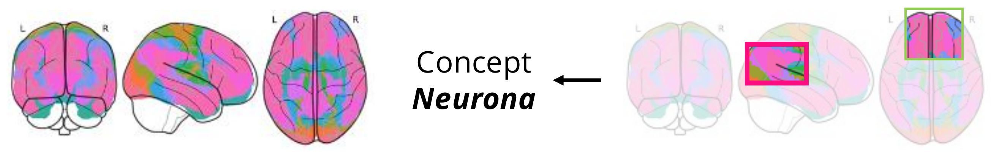
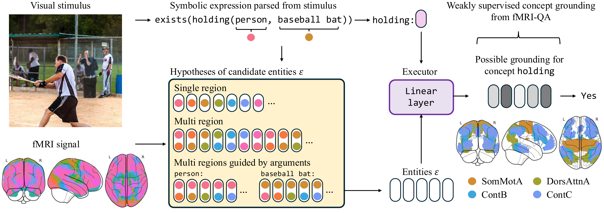

# NEURONA: Neuro-Symbolic Decoding of Neural Activity

<p align="center">
  
</p>

<p align="center">
  <a href="https://arxiv.org/abs/2603.03343">Paper</a> |
  <a href="https://ppwangyc.github.io/projects/neurona/">Project Page</a> |
  <a href="https://huggingface.co/datasets/PPWangyc/BOLD5000-QA">Dataset</a>
</p>

NEURONA is a neuro-symbolic framework for fMRI decoding and concept grounding in neural activity. It leverages image-based fMRI question-answering datasets to learn how to decode interacting concepts from visual stimuli based on patterns of fMRI responses. The framework integrates symbolic reasoning and compositional execution with fMRI grounding across brain regions.

## Method

<p align="center">
  
</p>

NEURONA operates through a four-step pipeline:

1. **Parse Query**: Each query (e.g., *"Is there a person holding a baseball bat?"*) is parsed into a symbolic expression with predicate-argument structure.
2. **Encode fMRI**: Voxel-level fMRI signals are parcellated into functional networks using a standard atlas (e.g., Yeo-17), yielding parcel embeddings as candidates for concept grounding.
3. **Ground Concepts**: Each concept is grounded to brain parcels via learned neural modules.
4. **Compose & Answer**: Grounded scores are composed according to the symbolic expression to produce a final answer.

## Setup

### Environment

```bash
cd scripts
source setup.sh
```

This creates a conda environment `neurona` with all dependencies.

### Data

Download the [BOLD5000-QA](https://huggingface.co/datasets/PPWangyc/BOLD5000-QA) dataset:

```bash
cd scripts
source download_data.sh
```

This requires a HuggingFace token. Run `huggingface-cli login` first or set the `HF_TOKEN` environment variable.

To recreate the dataset from raw BOLD5000 data, see [`scripts/dataset/README.md`](scripts/dataset/README.md).

## Training

Training is configured via YAML config files in [`configs/`](configs/). An example config is provided at [`configs/neurona_bold5000.yaml`](configs/neurona_bold5000.yaml).

```bash
cd scripts
source train_bold5000.sh neurona_bold5000
```

To override the subject from the command line:

```bash
source train_bold5000.sh neurona_bold5000 CSI1
```

### Config Options

See [`configs/neurona_bold5000.yaml`](configs/neurona_bold5000.yaml) for all available options:

| Option | Default | Description |
|--------|---------|-------------|
| `subject` | `CSI1` | Subject ID (e.g., `CSI1`, `CSI2`, `CSI3`, `CSI4`) |
| `data_dir` | `data/BOLD5000-QA` | Path to dataset |
| `dataset` | `BOLD5000` | Dataset name |
| `epochs` | `100` | Number of training epochs |
| `batch_size` | `32` | Batch size |
| `seed` | `42` | Random seed |
| `train_hop` | `all` | Training hop: `all`, `zs` (zero-shot), or `1`/`2`/`3` |
| `atlas` | `yeo17` | Brain atlas: `yeo7`, `yeo17`, `difumo1024` |
| `ground_attr_region` | `true` | Ground attribute concepts to brain regions |
| `ground_attr_relation` | `true` | Ground attribute concepts using region relations |
| `ground_rel_region` | `true` | Ground relational concepts to brain regions |
| `ground_rel_relation` | `true` | Ground relational concepts using region relations |
| `ground_rel_guided_relation` | `guide-all` | Guidance mode: `guide-all`, `guide-subject`, `guide-object`, `guide-off` |

CLI arguments can also override any config value:

```bash
jac-run src/train_bold5000.py --config configs/neurona_bold5000.yaml --batch_size 16 --epochs 50
```

## Reading Results

```bash
cd src
python read_results.py --config ../configs/neurona_bold5000.yaml
```

## Project Structure

```
neurona/
  configs/
    neurona_bold5000.yaml   # Training config for BOLD5000
  src/
    train_bold5000.py       # Main training script
    read_results.py         # Gather and display results
    create_dataset/         # Dataset creation scripts
    loader/
      fqa.py                # fMRI QA dataset loader
    models/
      fmri/simple_cnn.py    # fMRI region embedding model
      left/                 # Logic-based reasoning framework
    utils/
      utils.py              # Arguments and configuration
      plot_utils.py         # Evaluation and visualization
      log_utils.py          # Logging
      dataset_utils.py      # Dataset processing utilities
  scripts/
    setup.sh                # Environment setup
    download_data.sh        # Data download
    train_bold5000.sh       # training script
    dataset/                # Dataset creation scripts (see dataset/README.md)
  third_party/
    Concepts/               # Symbolic reasoning framework
    Jacinle/                # Deep learning utilities
  data/
    BOLD5000-QA/            # BOLD5000 fMRI QA dataset
```

## Acknowledgements

We thank the teams behind [BOLD5000](https://github.com/BOLD5000-dataset/BOLD5000) and [Courtois NeuroMod](https://github.com/courtois-neuromod/cneuromod) for making their fMRI datasets publicly available.

## Citation

```bibtex
@article{wang2026neuro,
  title={Neuro-Symbolic Decoding of Neural Activity},
  author={Wang, Yanchen and Hsu, Joy and Adeli, Ehsan and Wu, Jiajun},
  journal={arXiv preprint arXiv:2603.03343},
  year={2026}
}
```
